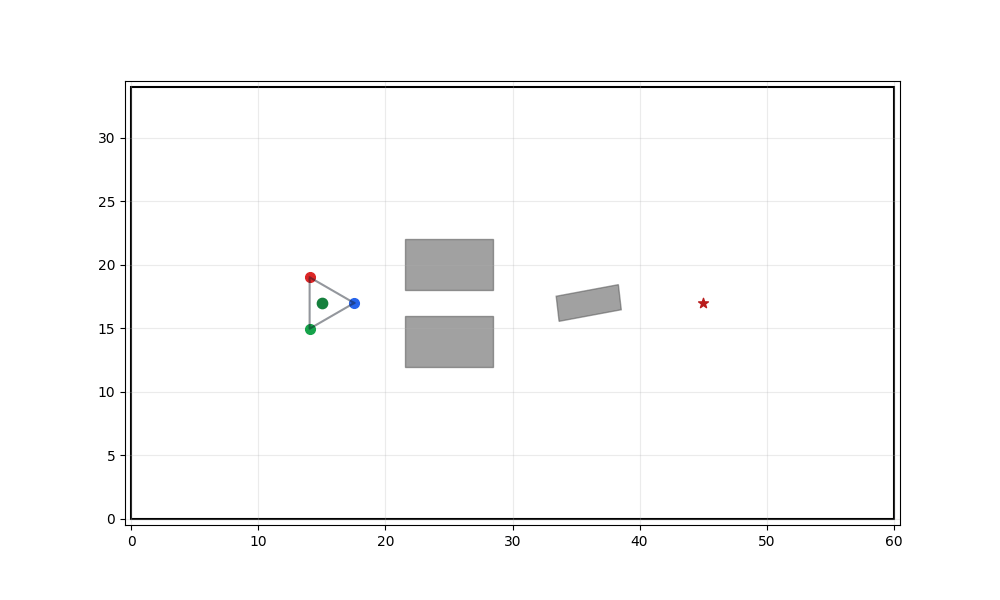
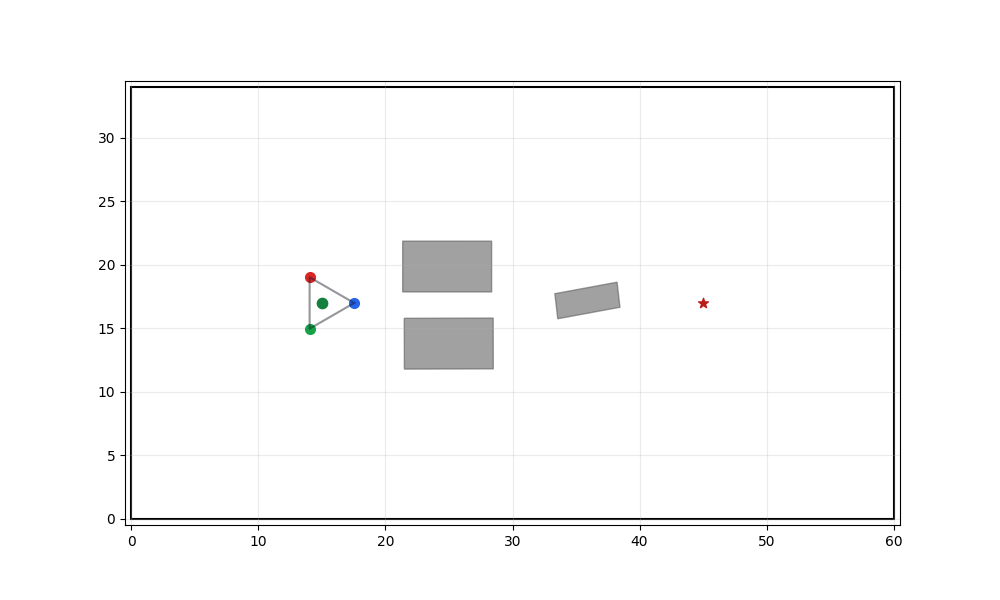
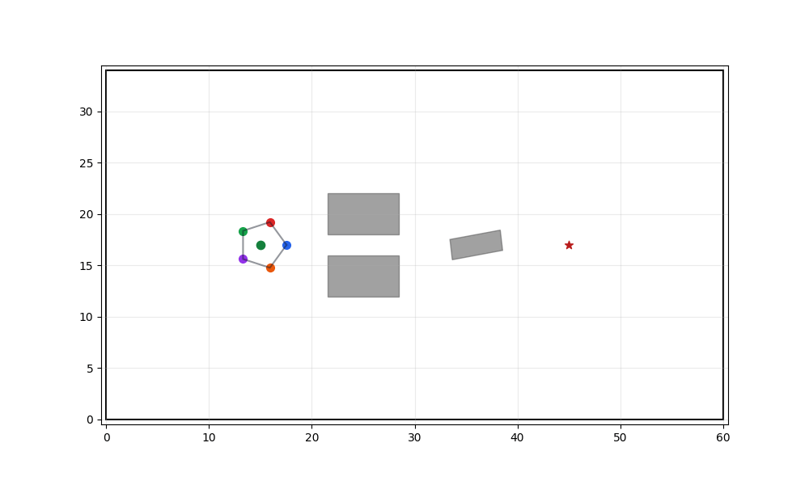

# CPDOT Python Reproduction

[Chinese](README.md) | [English](README.en.md)

CPDOT Python Reproduction is a Python reproduction of the core planning
pipeline from the paper **Multi-Nonholonomic Robot Object Transportation with
Obstacle Crossing using a Deformable Sheet**. The project includes algorithm
implementations, tests, visualization scripts, and fixture data extracted from
C++ outputs.

The default configuration uses a 3-vehicle formation and supports
`N in [3, 7]`. For experiments that follow the paper pipeline, use
`--mode source --source-solver-method ipopt`.

## Visual Results

The source-mode animation results currently stored under `outputs/`.

### 3 vehicles

<p>
  
  
</p>

### 5 vehicles

<p>
  
</p>

## Installation

Python 3.10 is required. Conda is recommended:

```bash
cd CPDOT

conda env create -f environment.yml
conda activate cpdot-py
```

To update an existing environment:

```bash
conda env update -f environment.yml --prune
conda activate cpdot-py
```

You can also use pip:

```bash
python -m pip install -r requirements.txt
```

The CasADi pip package ships with an IPOPT binary backend, so IPOPT usually
does not need to be built separately.

## Full Test Commands

The commands below cover test collection, the full test suite, quick demos, the
source stage pipeline, the complete source pipeline, animation generation, and
animation playback.

```bash
cd CPDOT
conda activate cpdot-py

# 1. Confirm tests can be collected
python -m pytest --collect-only tests -q

# 2. Run the full test suite
python -m pytest tests -q

# 3. Clear old outputs so subsequent file names are deterministic
rm -rf outputs

# 4. Quick smoke demo, generating a static image
python main.py --mode fast --scene-seed 0

# 5. Quick smoke demo, generating an animated GIF
python main.py --mode fast --scene-seed 0 --animate

# 6. Run source stages one by one and save intermediate results
python main.py --mode source --scene-seed 0 --source-stage topo
python main.py --mode source --scene-seed 0 --source-stage combo
python main.py --mode source --scene-seed 0 --source-stage corridor
python main.py --mode source --scene-seed 0 --source-stage coarse
python main.py --mode source --scene-seed 0 --source-stage plan \
  --source-warm-starts 1 --source-initial-warm-starts 1 \
  --source-solver-method ipopt

# 7. Visualize the plan stage result
python scripts/visualize_stage.py \
  --npz outputs/source_stage_plan.npz \
  --output outputs/source_stage_plan.png

# 8. Run the complete paper pipeline and generate a static image plus GIF
python main.py --mode source --scene-seed 0 \
  --source-warm-starts 1 --source-initial-warm-starts 1 \
  --source-solver-method ipopt --animate

# 9. Play animations
xdg-open outputs/cpdot_animation.gif
xdg-open outputs/cpdot_source_animation.gif
```

Visualization results (`.png`, `.gif`, and `.npz`) are saved under `outputs/`.
If the directory is missing, it is created automatically on the first run.

## CLI Modes

| Mode | Command | Description |
|---|---|---|
| `fast` | `python main.py --mode fast` | Quick smoke demo using a lightweight heuristic smoother; not intended as paper reproduction data |
| `source` | `python main.py --mode source --source-solver-method ipopt` | Runs the core paper pipeline: TopologyPRM, homotopy combinations, corridors, coarse planning, and Plan_fm |
| `source-single` | `python main.py --mode source-single` | Diagnostics for the single-robot Plan, diff-drive, and car-like replan branches |

Output files in `outputs/` do not overwrite existing results. If a target file
already exists, suffixes such as `_001` and `_002` are appended automatically.
Run `rm -rf outputs` first when fixed file names are needed.

## Directory Layout

```text
.
├── README.md
├── README.en.md
├── environment.yml / requirements.txt
├── main.py                        # CLI entry point
├── cpdot_py/                      # Algorithm package
│   ├── topo_prm.py                  # Topological PRM (guard/connector)
│   ├── homotopy.py                  # Homotopy combinations + scoring + corridors
│   ├── coarse_path_planner.py       # Hybrid A* + 2D DP heuristic
│   ├── sfc.py                       # DecompROS ellipsoid safe flight corridor
│   ├── forward_kinematics.py        # Deformable sheet taut-subset + KKT
│   ├── optimizer.py                 # Four NLPs (scipy backend)
│   ├── optimizer_casadi.py          # Four NLPs (CasADi/IPOPT backend)
│   ├── formation.py                 # FormationPlanner / Plan_fm main loop
│   ├── env.py / geometry.py         # Obstacles / geometry
│   ├── states.py                    # TrajectoryPoint / FullStates / Constraints
│   ├── metrics.py                   # ring-Laplacian formation_similarity
│   ├── cpp_fixtures.py              # Loads YAML from cpp_fixtures/
│   └── visualization.py             # Static plots / animations
├── tests/                         # pytest tests
├── scripts/                       # Batch experiments, stage visualization, Gazebo comparison
├── cpp_fixtures/                  # Original paper C++ NLP outputs (N=3 + N=5)
│   └── flexible_formation/
│       ├── 3/                       # traj_3R1000.yaml + traj_real3R.yaml + ...
│       └── 5/
└── outputs/                       # Demo output directory, generated at runtime
```

## Algorithm to Code Map

| Algorithm step | Python module |
|---|---|
| Center topological PRM | `cpdot_py.TopologyPRM` |
| Homotopy combination enumeration + safety / length / homotopy scoring | `cpdot_py.cal_combination` |
| Per-robot bbox half-space corridors | `cpdot_py.cal_corridors` |
| Hybrid A* coarse planning | `cpdot_py.CoarsePathPlanner` |
| DecompROS safe flight corridor | `cpdot_py.generate_sfc` |
| Deformable sheet forward kinematics (taut-subset + KKT) | `cpdot_py.ForwardKinematics` |
| Four NLPs (car-like / diff-drive / replan / formation) | `cpdot_py.{CarLike,DiffDrive,CarLikeReplan,Formation}NLPProblem` |
| Plan_fm warm-start main loop | `cpdot_py.FormationPlanner.plan_fm_from_guess` |

## Notes

- **Solver backend**: scipy (L-BFGS-B + finite differences, default) or
  CasADi+IPOPT (`--source-solver-method ipopt`). scipy is only suitable for
  smoke tests and `--mode fast`; use IPOPT for paper-style data.
- **C++ source bug reproduction flags**: The paper's C++ source has three known
  bugs (`BeyondInterdisCons` double indexing and unconditional `return true` in
  `IdentifyHomotopy.cpp`, double indexing in
  `combinations[sorted_indices[sorted_indices[i]]]`, and an early return in
  `Plan_fm` when `warm_start == 5`). Python uses the intended fixed behavior by
  default. Use `--source-strict-homotopy-bugs` and
  `--source-strict-cpp-early-return` to reproduce the source-code bugs.
- **Fixture data**: `cpp_fixtures/` comes from the original C++ repository's
  `formation_planner/traj_result/flexible_formation/{3,5}/` outputs and is used
  as a comparison baseline for the Python implementation.
- **Regression baseline**: In the N=3 fixture scenario, the Python IPOPT result's
  `tf` deviation from the C++ NLP output is constrained by
  `tests/test_cpp_baseline_diff.py` to stay within 0.2%.
